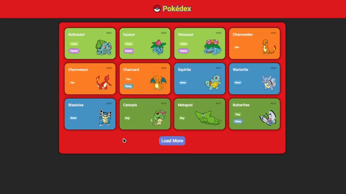

<h1 align="center"> Desafio da DIO - Pokédex </h1>

 

  

## 🚀 Tecnologias

Esse projeto foi desenvolvido com as seguintes tecnologias:

- HTML, CSS e JavaScript
- Git e Github

## 💻 Projeto

Uma pokédex!

- [Para ver no site](https://lupyeah.github.io/Pokedex/index.html)

## 📋 Funcionalidades

- 📌 Pokédex!
- ❗ Informações principais dos pokémons!
---
